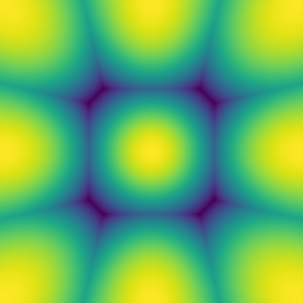
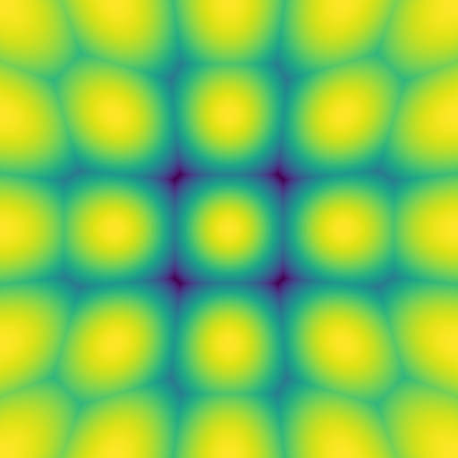
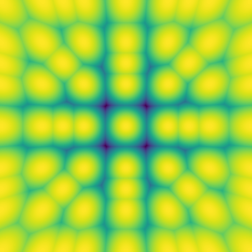
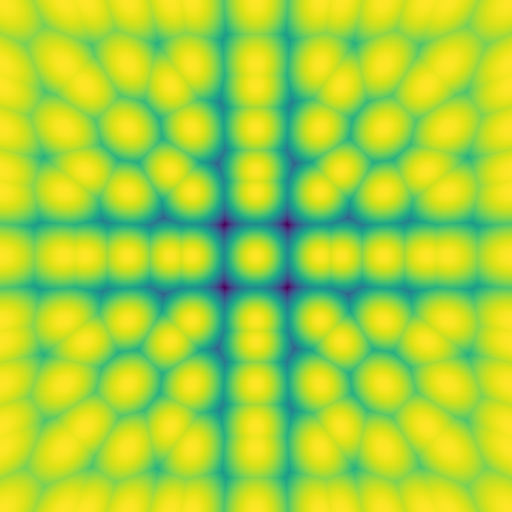

# Rounding Experiments

I'm trying to find a general method to round vectors.

The ideal vector rounding which minimizes the angle with the full-precision vector is **NOT a grid**.
It looks more like [Voronoi cells](https://en.wikipedia.org/wiki/Voronoi_diagram) on an [n-sphere](https://en.wikipedia.org/wiki/N-sphere) (for scaled integer vectors without an offset, at least).

I'm trying to find a general way to tractably find the nearest representable scaled integer vector in a reasonable amount of time[^1].  I'm planning to eventually make a blog post about it to explain it in more detail.  The geometric rationale behind it will probably be cool.

[^1]: This is similar, but quite different from [trellis coding](https://arxiv.org/html/2406.11235v3#:~:text=tractably%20find%20the%20closest%20representable%20vector). The [goal is different](<https://arxiv.org/html/2406.11235v3#:~:text=The%20main%20focus%20of%20QTIP%C2%A0is%20on%20what%20to%20quantize%20with%20(i.e.%C2%A0TCQ)%20and%20not%20how%20to%20quantize%20(e.g.%C2%A0adaptive%20rounding%20or%20descent%20methods).>). Here, the focus is on rounding.

This is what the best rounding looks like on a face of a cube (i.e. a vector with 3 components with the max being scaled to 1), for ternary `{-1, 0, 1}`:

And for pentary `{-2, -1, 0, 1, 2}`:

The weird stuff starts to happen at heptary `{-3, -2, -1, 0, 1, 2, 3}`:

Starting from enneary `{-4, -3, -2, -1, 0, 1, 2, 3, 4}`, floating point errors on the rounding scaling factor become noticeable and have to be considered. Thankfully, it seems like changing the scale by `(2**23 + 1) / (2**23)` (the next representable number after 1) is enough to make it work as far as I've tested it (`[-31, 31]`).

From `[-63, 63]` (7-bit) there are some small artifacts again caused by floating point precision, but this time when sorting fractions when ordering the consecutive rounding scales.

TODO: add higher-precision visualizations.

(These images are best viewed from inside a cube with all faces set to use the desired image as a texture)

---

My main unsolved challenges right now:

- ~~Generalize to more than `{-3, -2, -1, 0, 1, 2, 3}`~~
  - Solved, the problem was off-by-one floating point errors introduced by division and multiplication of the rounding scale.
- Prove that a particular algorithm produces the best possible rounding
  - I guess it can be proved informally by noticing that there are no sharp transitions in the errors?
  - Still would eventually need a formal proof, although with floating point numbers it won't ever be perfect.
- Check if nested superblock rounding can be improved
- Remove the need for sorting the components to find the best rounding scale
- Find a fast enough general method to find **both** the best rounding offset *and* scale combination
  - ~~I *think* the `anyrize_offset_min_mean` function in `rounding.py` *might* be it.~~
    - Nope, this doesn't explore the whole search space.
- Asymmetric zero-point quantization
  - It seems like with certain importance distributions, the sign of the best scale is not necessarily the sign of the absolute max value.

# Goals

One of the goals of this is to improve the rounding algorithms used in k-quants in [`llama.cpp`](https://github.com/ggerganov/llama.cpp).

If this somehow turns out to be equivalent to what's already used in k-quants, then at least this can serve as the basis for a geometric interpretation of k-quants.

Another eventual goal is to try the effect of the "best" rounding schemes on quantization-aware training and to test if it matters or not.
